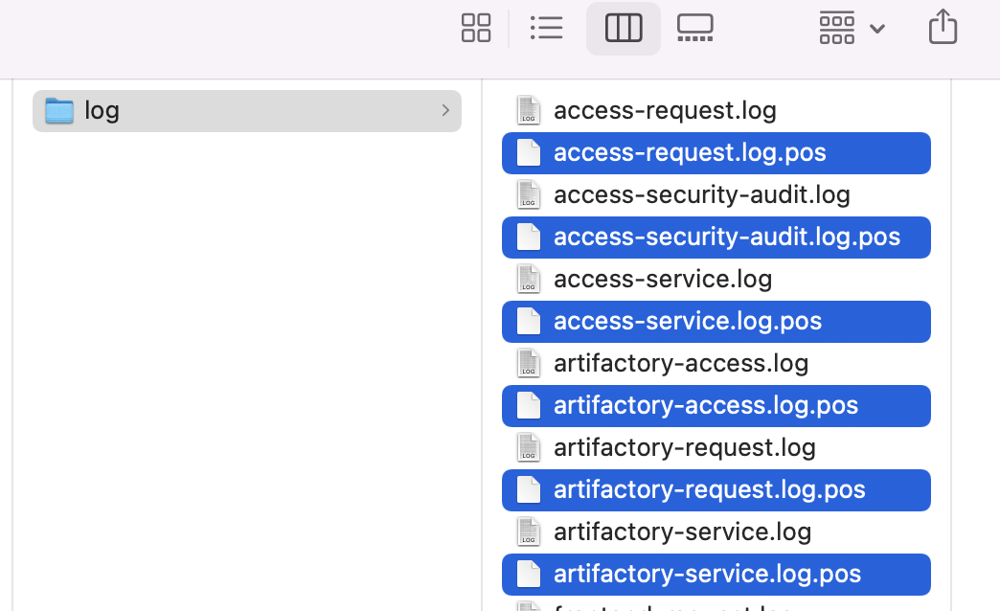

# EFK

This project enables you to start the EFK platform with one click via docker compose to analyze JFrog logs or Support Bundle to understand the status of the system through pre-configured reports

## Preparation

1. Prepare docker compose environment

        Please install docker and docker compose in your environment
        e.g. Docker version 20.10.21, Docker Compose version v2.13.0

        mac m1 can be used as the installation environment

2. Prepare JFrog logs

        To get logs for JFrog products, you can choose to:
        1. Operate on the server where the JFrog product is installed, obtain the log from the directory where the log is located, and refer to the document https://www.jfrog.com/confluence/display/JFROG/Logging
        
        2. Operate on the JFrog Artifactory page, create a Support Bundle to obtain logs, refer to the document https://www.jfrog.com/confluence/display/JFROG/Support+Zone

3. Put the log under a certain path

        e.g. 
        /Users/kyle/Downloads/exk-var/log

## Installation

1. Modify the path where the log is located

        vi docker-compose.yaml
        JF_PRODUCT_DATA_INTERNAL: "/Users/kyle/Downloads/efk-var"

2. Start EFK and log in

        ./1-run.sh (docker-compose up)
        
        You can kill this process at any time, and execute this command again next time
        If you want to start over (delete the last running state and configuration via its UI)
        please refer to '5. Reset this project' in this document)

        http://localhost:5601
        user: elastic
        password: changeme

3. Import pre-configured reports

        ui > Stack management > saved object > import > select ./kibana/kibana_dashboard-xxx.ndjson (will create index called unified-artifactory （timestamp is the column name of time for chart in this index）)

4. Start using

        - Discovery logs, the default graph showing request volume over time
        ui > Discover

        From this chart, it can be seen that the number of various log requests during the peak period is as high as 290

        - View preconfigured dashboard
        ui > Dashboard

        From these charts, it can be seen that the number of various log requests during the peak period is as high as 290, and the changes in download volume and time-consuming in a day can also be seen

        - You can also configure more visual charts by yourself, save and add them to the Dashboard for easy viewing at any time
        ui > Visualize

5. Reset this project

        When starting this project for the first time, docker build was performed. If you have any source code changes, please remember to reset/delete the previously built docker image

        ./0-reset.sh

        And remember to delete the xxx.pos files automatically generated by fluentd in the directory where the logs are located. These files are used to record that the logs have been processed, so when you want to start over, remember to delete them

        

## others

- Uplaod and analyze arbitrary logs (not JFrog logs)

        Although this project is used for JFrog log analysis, it can actually be used for other purposes after startup

        - how
        ui > home > upload a file > override settings > time field > select the column has date value e.g. column1 > click import > create (input if exists) index pattern name e.g. unified-artifactory

        - about time field
        if to use default timeline chart in Discover page 
        change the column name to @timestamp

        - limitation
        100M limited, no defined column name

- Use as ELK

        This project also includes the configuration of logstash
        so you can modify docker-compose.yml to comment out the part of Eluentd and remove the comments of logstash
        
        1. reset & restart the ELK

                ./0-reset.sh
                ./1-run.sh

        2. import log by tcp & create index pattern
                
                cat ./sample-logs/artifactory-request.log | nc -c localhost 5001
                this way, column names are defined in ./pipeline/logstash.conf

        3. create index pattern

                import log before this step, then you can choose the name for time field you defined in ./pipeline/logstash.conf, otherwise by default you only can choose @timestamp

                ui > Discover > enter unified-artifactory (default is logstash-*) > next step > select time field e.g. timestamp
                
        4. start to use

- todo

        - xray log

                - error
                unmatched_lines

        - xray violation
        
                - via fluentd plugin (ruby gem)
                https://github.com/jfrog/fluent-plugin-jfrog-siem

                look into https://github.com/jfrog/fluent-plugin-jfrog-siem/tree/main/fluentd/plugins/input/fluent-plugin-jfrog-siem/lib/fluent/plugin

        

